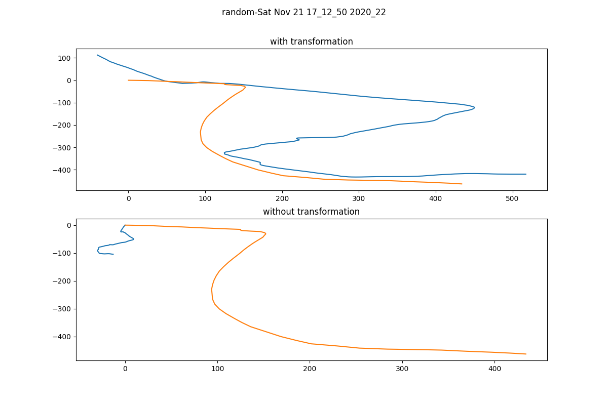

# ML Dead Reckoning Project

You can read our final report **[HERE!](https://drive.google.com/file/d/1XakMqmdHKZihGpyVovoREF0mSX7DZ4Nq/view?usp=sharing)**

### Background
GPS has many crucial applications, like vehicle navigation. However, in urban environments where tall obstructions (like buildings) can block GPS, the vehicle needs more information about its surroundings, which sensors like IMUs can provide. However, IMUs tend to drift over time and this offset can be different across different IMU calibrations. To resolve this, vehicles rely on a fusion of sensor data, but this can add significantly to system cost and complexity. Therefore, this project aims to use machine learning to estimate vehicle position in GPS-poor environments. 

### Methodology

#### Data Collection

In order to design, train, and validate our models, we need IMU data from a moving vehicle, as well as a source of ground truth position information. We used an ICM-20948 as the primary IMU, with an XA1110 GPS module to provide concrete position information to validate against. Both were connected to a Raspberry Pi which logged the data at 200Hz for the IMU, and 1Hz for the GPS. With this setup, we were able to collect approximately 16 hours of driving data ourselves.

    

#### Data Processing

* **split the data into smaller segments when the vehicle is stationary:** This allows us to isolate specific maneuvers (i.e. turns, straights, etc), and also zero out IMU drift based on the stationary periods. 

* **Interpolate samples:** Required because the GPS is sampled at a lower rate (1 Hz) than the IMU (200 Hz).

* **Align GPS and IMU position curves using RANSAC:** Since the IMU does not have a reference for absolute heading, and our self-collected dataset was not large, we used the RANSAC algorithm to register the GPS and IMU position curves together as closely as possible before handing off the data to the neural net architecture.  

* **Train NN to output predicted vehicle position using DAgger method with Seq2Seq model and encoder/decoder architecture:** We pass in the pre-processed IMU and GPS positions as input to our NN so that it can learn to predict vehicle position with limited access to GPS data at test time.

### Results

Through our methods, we were able to recover a vehicle position curve (green + red) from imu data (blue) that was far closer to the ground truth (black) than the imu data. The red segments on the predicted position line indicate segments of GPS outage, where our trained model is able to predict the vehicle's true position without any GPS data. As a note, the gif is running at 10x speed, and this trajectory represents a path we collected in a personal vehicle. 

### Conclusion

Overall, our approach is able to recover true position in GPS-poor environments with good performance over long distances travelled by the vehicle, generalizable and robust to non-uniform sensor offset and drift, and can be replicated in real driving environments with relatively low cost.

In the future, we want to work towards true dead-reckoning, where we only use the IMU data as an input. To do this, we would first need to solve the inconsistency in gyro offset between different runs. If we resolved this issue, we can consider two approaches to achieve true dead-reckoning with only IMU data:
1. (Existing Approach) Adapt our solution in this project for 100% GPS dropout
2. (New Approach) Develop an ML model to update the covariance matrices (or uncertainty) of a Kalman Filter, which is commonly used to predict state estimates of a vehicle

### Getting Started

Ensure you have the following data file structure before running any code:

* csv/
  * 200hz/
  * 50hz/
* gps_vs/
* gpx/
* imu_vs/
* split_csv/
  * 200hz/
  * 50hz/

To generate the necessary files:
1. download all the gps files from [here](https://drive.google.com/drive/folders/1qxS9KQhh8YOQu1bCvFi2HpZ4WJnd6smr?usp=sharing) and place into the `csv/200hz` directory.

2. Run the following from the `Scripts/` directory to generate the proper files (this will take a while, like 15-30 minutes):

        python split_csv.py && python process_data.py && python gps_to_vel.py && python sync_curves.py --save_pos 

3. To evaluate the model trained with , run:  
    <pre><code>python seq2seq.py --dataset_csv "full_dataset.csv" --test_files "full_dataset_test_list.txt" --eval_model seq2seqmodel_1.0beta_noannealing --gps_dropout 0.3
    </code></pre>
    To evaluate the model trained with , run:
    <pre><code>
    python seq2seq.py --dataset_csv "full_dataset.csv" --test_files "full_dataset_test_list.txt" --eval_model seq2seqmodel_0.75beta_noannealing --gps_dropout 0.3
    </code></pre>

4. (Optional) To generate the gpx files, run `python log_to_gpx.py` from the `Scripts/` directory. You can view them in a gpx visualizer like [gpsvisualizer.com](https://www.gpsvisualizer.com/).

